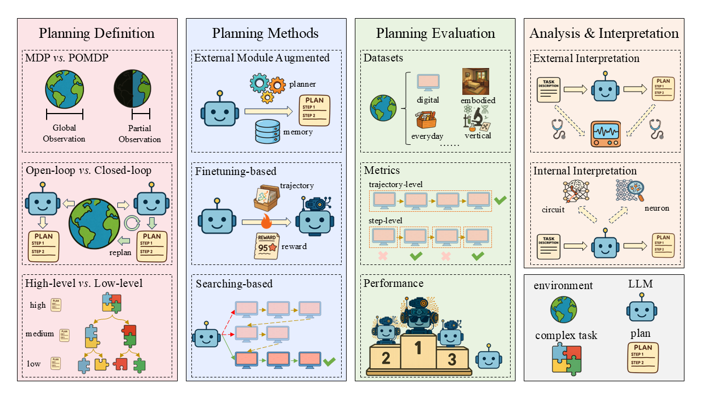
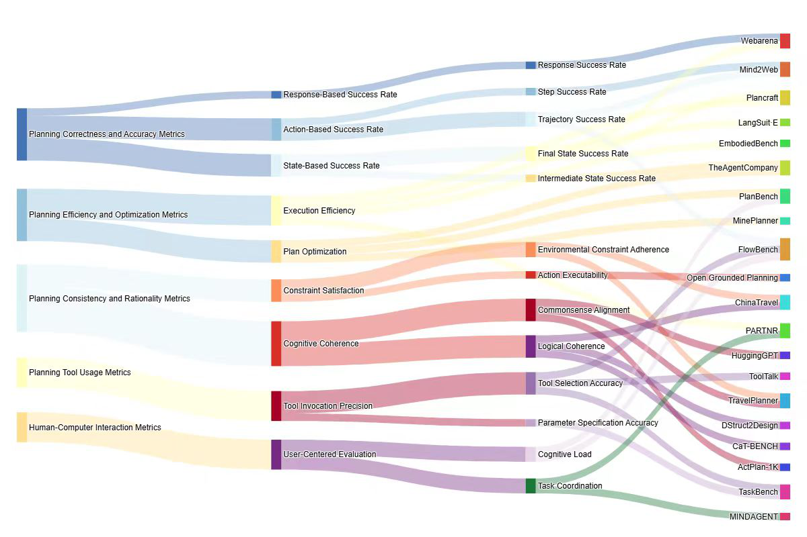
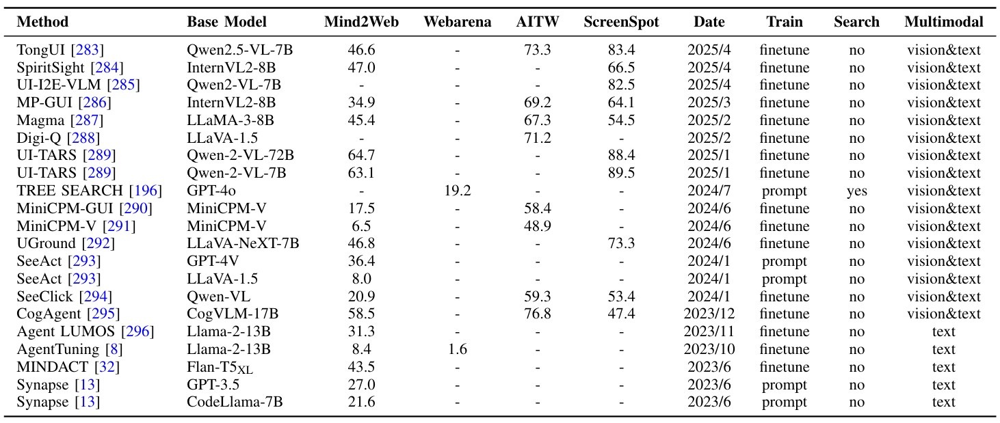
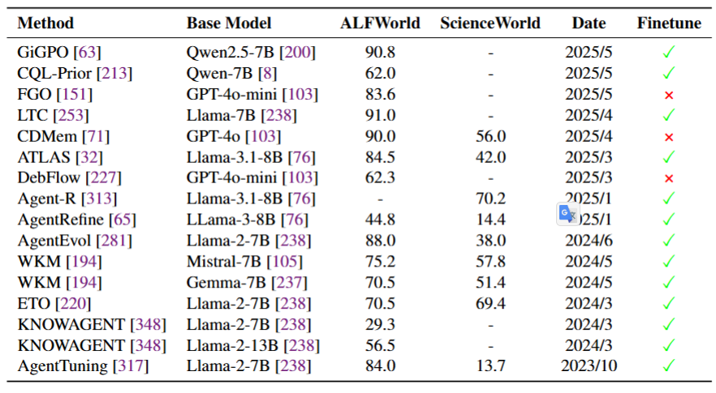
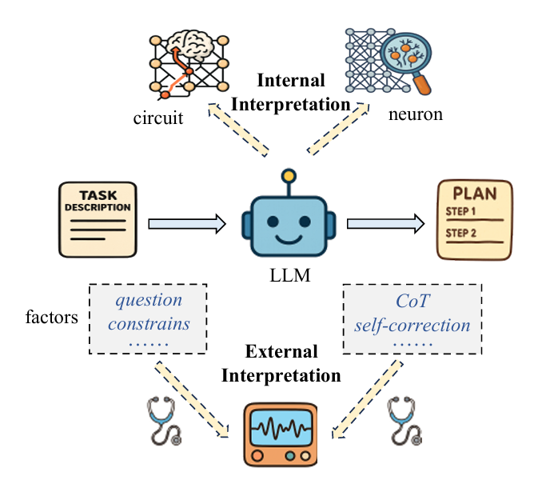

# A Comprehensive Survey on Large Language Model Based Planning

Welcome to the **Awesome-LLM-Planning** repository! This repository is a curated collection of the most influential papers, and benchmarks related to **Large Language Models (LLMs) based Agent Planning**. For a detailed introduction, please refer our survey paper:

**A Comprehensive Survey on Large Language Model Based Planning** 

  

An overview of LLM-based agent planning, covering its definition, methods, evaluation approaches, and analysis and interpretation.

## 1 Planning Methods

### 1.1 External Module Augmented Methods

<iframe src="docs/exexternal_module.pdf"
 width="800px" height="2400px"></iframe>

#### 1.1.1 Planner Enhanced Methods 

* **Hierarchical Planning For Complex Tasks With Knowledge Graph-Rag And Symbolic Verification**  
* **LLM+ Map: Bimanual Robot Task Planning Using Large Language Models And Planning Domain Definition Language**  
* **Robust Planning With Compound LLM Architectures: An LLM-Modulo Approach**  
* **Can Llms Plan Paths With Extra Hints From Solvers?**  
* **Planetarium: A Rigorous Benchmark For Translating Text To Structured Planning Languages** 
* **Trip-Pal: Travel Planning With Guarantees By Combining Large Language Models And Automated Planners**  
* **PDDLEGO: Iterative Planning In Textual Environments**  
* **PROC2PDDL: Open-Domain Planning Representations From Texts**  
* **Leveraging Environment Interaction For Automated PDDL Translation And Planning With Large Language Models**   
* **Position: Llms Can’t Plan, But Can Help Planning In LLM-Modulo Frameworks** 
* **Memorybank: Enhancing Large Language Models With Long-Term Memory** 
* **Explicit Memory Learning With Expectation Maximization**  
* **To The Globe (Ttg): Towards Language-Driven Guaranteed Travel Planning** 
* **Autoplanbench: Automatically Generating Benchmarks For LLM Planners From PDDL** 
* **Dynamic Planning With A LLM**  
* **LLM+P: Empowering Large Language Models with Optimal Planning Proficiency**  
* **Translating Natural Language To Planning Goals With Large-Language Models** 
* **Generative Agents: Interactive Simulacra Of Human Behavior**  
* **Think Before You Act: Decision Transformers With Working Memory**  
* **Leveraging Pre-Trained Large Language Models To Construct And Utilize World Models For Model-Based Task Planning**  
* **Synapse: Trajectory-As-Exemplar Prompting With Memory For Computer Control**  
* **Coupling Large Language Models With Logic Programming For Robust And General Reasoning From Text**  
* **Ldm2: A Large Decision Model Imitating Human Cognition With Dynamic Memory Enhancement**  
* **Learning Adaptive Planning Representations With Natural Language Guidance**  

#### 1.1.2 Memory Enhanced Methods 

* **Crafting Personalized Agents Through Retrieval-Augmented Generation On Editable Memory Graphs**  
* **Exploratory Retrieval-Augmented Planning For Continual Embodied Instruction Following**  
* **Large Language Models Are Semi-Parametric Reinforcement Learning Agents**  
* **A Survey On Large Language Model Based Autonomous Agents**  
* **Jarvis-1: Open-World Multi-Task Agents With Memory-Augmented Multimodal Language Models**  
* **Learning Memory Mechanisms For Decision Making Through Demonstrations**  
* **The Rise And Potential Of Large Language Model Based Agents: A Survey**  
* **Ghost In The Minecraft: Generally Capable Agents For Open-World Environments Via Large Language Models With Text-Based Knowledge And Memory**  
* **Mot: Memory-Of-Thought Enables Chatgpt To Self-Improve**  
* **Memgpt: Towards Llms As Operating Systems**  
* **Clin: A Continually Learning Language Agent For Rapid Task Adaptation And Generalization**  
* **Open-Ended Instructable Embodied Agents With Memory-Augmented Large Language Models**  
* **Think-In-Memory: Recalling And Post-Thinking Enable Llms With Long-Term Memory**  

### 1.2 Finetuning-based Methods
#### 1.2.1 Imitation Learning-based Methods 
* **Opencodereasoning: Advancing Data Distillation For Competitive Coding**  
* **Self-Improvement Towards Pareto Optimality: Mitigating Preference Conflicts In Multi-Objective Alignment**  
* **Enhancing Reasoning Capabilities Of Llms Via Principled Synthetic Logic Corpus**  
* **Horizon-Length Prediction: Advancing Fill-In-The-Middle Capabilities For Code Generation With Lookahead Planning**  
* **Cooperative Strategic Planning Enhances Reasoning Capabilities In Large Language Models**  
* **Dualformer: Controllable Fast And Slow Thinking By Learning With Randomized Reasoning Traces**  
* **Camphor: Collaborative Agents For Multi-Input Planning And High-Order Reasoning On Device** 
* **Selp: Generating Safe And Efficient Task Plans For Robot Agents With Large Language Models**  
* **Synatra: Turning Indirect Knowledge Into Direct Demonstrations For Digital Agents At Scale** 
* **Learning To Plan Long-Term For Language Modeling** 
* **Agentgen: Enhancing Planning Abilities For Large Language Model Based Agent Via Environment And Task Generation**  
* **Retrieve-Plan-Generation: An Iterative Planning And Answering Framework For Knowledge-Intensive LLM Generation**  
* **Mixture-Of-Agents Enhances Large Language Model Capabilities**  
* **Ask-Before-Plan: Proactive Language Agents For Real-World Planning** 
* **Learning To Plan For Retrieval-Augmented Large Language Models From Knowledge Graphs**  
* **Distilling Instruction-Following Abilities Of Large Language Models With Task-Aware Curriculum Planning** 
* **Monte Carlo Tree Search Boosts Reasoning Via Iterative Preference Learning**  
* **Agent Planning With World Knowledge Model**  
* **Stream Of Search (Sos): Learning To Search In Language**  
* **Agent-Flan: Designing Data And Methods Of Effective Agent Tuning For Large Language Models**  
* **Knowagent: Knowledge-Augmented Planning For LLM-Based Agents**  
* **Beyond A\*: Better Planning With Transformers Via Search Dynamics Bootstrapping**  
* **Autoact: Automatic Agent Learning From Scratch Via Self-Planning**  
* **Adapting LLM Agents With Universal Feedback In Communication**  
* **Fireact: Toward Language Agent Fine-Tuning**  
* **You Only Look At Screens: Multimodal Chain-Of-Action Agents**  
* **Multimodal Web Navigation With Instruction-Finetuned Foundation Models**  
* **Training Verifiers To Solve Math Word Problems** 
#### 1.2.2 Feedback-based Methods
* **Gui-R1: A Generalist R1-Style Vision-Language Action Model For Gui Agents**  
* **Infigui-R1: Advancing Multimodal Gui Agents From Reactive Actors To Deliberative Reasoners**  
* **Embodied-R: Collaborative Framework For Activating Embodied Spatial Reasoning In Foundation Models Via Reinforcement Learning**  
* **Retool: Reinforcement Learning For Strategic Tool Use In Llms**  
* **Toolrl: Reward Is All Tool Learning Needs**  
* **Otc: Optimal Tool Calls Via Reinforcement Learning** 
* **Boost, Disentangle, And Customize: A Robust System2-To-System1 Pipeline For Code Generation**  
* **Alphamaze: Enhancing Large Language Models' Spatial Intelligence Via Grpo**  
* **Swe-Rl: Advancing LLM Reasoning Via Reinforcement Learning On Open Software Evolution**  
* **Think Smarter Not Harder: Adaptive Reasoning With Inference Aware Optimization**  
* **Error Classification Of Large Language Models On Math Word Problems: A Dynamically Adaptive Framework**  
* **Closed-Loop Long-Horizon Robotic Planning Via Equilibrium Sequence Modeling**  
* **Thinking Llms: General Instruction Following With Thought Generation**  
* **Enhancing LLM Reasoning Via Critique Models With Test-Time And Training-Time Supervision**  
* **Webrl: Training LLM Web Agents Via Self-Evolving Online Curriculum Reinforcement Learning**  
* **Can LLM Be A Good Path Planner Based On Prompt Engineering? Mitigating The Hallucination For Path Planning**  
* **Flow Of Reasoning: Training Llms For Divergent Problem Solving With Minimal Examples**  
* **Rest-Mcts\*: LLM Self-Training Via Process Reward Guided Tree Search**  
* **Q\*: Improving Multi-Step Reasoning For Llms With Deliberative Planning**  
* **Learn Beyond The Answer: Training Language Models With Reflection For Mathematical Reasoning**  
* **Chain Of Preference Optimization: Improving Chain-Of-Thought Reasoning In Llms**  
* **Self-Play Preference Optimization For Language Model Alignment**  
* **Training Language Models To Self-Correct Via Reinforcement Learning**  
* **Cpl: Critical Plan Step Learning Boosts LLM Generalization In Reasoning Tasks** 
* **Self-Playing Adversarial Language Game Enhances LLM Reasoning**  
* **Advancing LLM Reasoning Generalists With Preference Trees** 
* **Autowebglm: A Large Language Model-Based Web Navigating Agent**  
* **Llms In The Imaginarium: Tool Learning Through Simulated Trial And Error**  
* **Trial And Error: Exploration-Based Trajectory Optimization For LLM Agents**  
* **React Meets Actre: When Language Agents Enjoy Training Data Autonomy**  
* **Learning Planning-Based Reasoning By Trajectories Collection And Process Reward Synthesizing**  
* **Self-Play Fine-Tuning Converts Weak Language Models To Strong Language Models**  
* **Beyond Human Data: Scaling Self-Training For Problem-Solving With Language Models**  
* **A Real-World Webagent With Planning, Long Context Understanding, And Program Synthesis**  
* **Language Models Can Teach Themselves To Program Better**  
* **Ui-R1: Enhancing Action Prediction Of Gui Agents By Reinforcement Learning** 
### 1.3 Searching-based Methods
#### 1.3.1 Decomposition-based Methods
* **Verilogcoder: Autonomous Verilog Coding Agents With Graph-Based Planning And Abstract Syntax Tree (Ast)-Based Waveform Tracing Tool**  
* **Agent-Oriented Planning In Multi-Agent Systems**  
* **Optimizing Chain-Of-Thought Reasoning: Tackling Arranging Bottleneck Via Plan Augmentation**  
* **Can We Further Elicit Reasoning In Llms? Critic-Guided Planning With Retrieval-Augmentation For Solving Challenging Tasks**  
* **Oscar: Operating System Control Via State-Aware Reasoning And Re-Planning**  
* **Plan-Rag: Planning-Guided Retrieval Augmented Generation**  
* **Travelagent: An AI Assistant For Personalized Travel Planning**  
* **Meta-Task Planning For Language Agents**  
* **A Human-Like Reasoning Framework For Multi-Phases Planning Task With Large Language Models**  
* **Urbanllm: Autonomous Urban Activity Planning And Management With Large Language Models**  
* **Paradise: Evaluating Implicit Planning Skills Of Language Models With Procedural Warnings And Tips Dataset** 
* **Rada: Retrieval-Augmented Web Agent Planning With Llms**  
* **Thoughts To Target: Enhance Planning For Target-Driven Conversation**  
* **Personal Large Language Model Agents: A Case Study On Tailored Travel Planning**  
* **Strength Lies In Differences! Improving Strategy Planning For Non-Collaborative Dialogues Via Diversified User Simulation**  
* **Protrix: Building Models For Planning And Reasoning Over Tables With Sentence Context**  
* **Adapt: As-Needed Decomposition And Planning With Language Models** 
* **Hugginggpt: Solving AI Tasks With Chatgpt And Its Friends In Hugging Face**  
* **Distilling Script Knowledge From Large Language Models For Constrained Language Planning**  
* **Interpretable Math Word Problem Solution Generation Via Step-By-Step Planning** 
* **Deductive Additivity For Planning Of Natural Language Proofs** 
* **Least-To-Most Prompting Enables Complex Reasoning In Large Language Models**  
* **Msi-Agent: Incorporating Multi-Scale Insight Into Embodied Agents For Superior Planning And Decision-Making** 
#### 1.3.2 Exploration-based Methods
* **Worldcoder, A Model-Based LLM Agent: Building World Models By Writing Code And Interacting With The Environment**  
* **Scaling Autonomous Agents Via Automatic Reward Modeling And Planning**  
* **Flow-Of-Options: Diversified And Improved LLM Reasoning By Thinking Through Options**  
* **Adaptive Graph Of Thoughts: Test-Time Adaptive Reasoning Unifying Chain, Tree, And Graph Structures**  
* **Step Back To Leap Forward: Self-Backtracking For Boosting Reasoning Of Language Models** 
* **Doubly Robust Monte Carlo Tree Search**  
* **Coat: Chain-Of-Associated-Thoughts Framework For Enhancing Large Language Models Reasoning** 
* **Qlass: Boosting Language Agent Inference Via Q-Guided Stepwise Search**  
* **Reflective Planning: Vision-Language Models For Multi-Stage Long-Horizon Robotic Manipulation**  
* **Codetree: Agent-Guided Tree Search For Code Generation With Large Language Models**  
* **Is Your LLM Secretly A World Model Of The Internet? Model-Based Planning For Web Agents**  
* **Reasonplanner: Enhancing Autonomous Planning In Dynamic Environments With Temporal Knowledge Graphs And Llms**  
* **System-1. X: Learning To Balance Fast And Slow Planning With Language Models** 
* **Tree Search For Language Model Agents**  
* **LLM-A\*: Large Language Model Enhanced Incremental Heuristic Search On Path Planning**  
* **Webpilot: A Versatile And Autonomous Multi-Agent System For Web Task Execution With Strategic Exploration**  
* **Graph Of Thoughts: Solving Elaborate Problems With Large Language Models**  
* **Tree-Planner: Efficient Close-Loop Task Planning With Large Language Models** 
* **Thoughtsculpt: Reasoning With Intermediate Revision And Search** 
* **Alphamath Almost Zero: Process Supervision Without Process**  
* **Search-In-The-Chain: Interactively Enhancing Large Language Models With Search For Knowledge-Intensive Tasks**  
* **Toolchain\*: Efficient Action Space Navigation In Large Language Models With A\* Search**  
* **Language Agent Tree Search Unifies Reasoning Acting And Planning In Language Models**  
* **Thought Propagation: An Analogical Approach To Complex Reasoning With Large Language Models**  
* **Algorithm Of Thoughts: Enhancing Exploration Of Ideas In Large Language Models**  
* **Toolllm: Facilitating Large Language Models To Master 16000+ Real-World Apis**  
* **Tree Of Thoughts: Deliberate Problem Solving With Large Language Models**  
* **Avis: Autonomous Visual Information Seeking With Large Language Model Agent**  
* **Large Language Models As Commonsense Knowledge For Large-Scale Task Planning**  
* **Reasoning With Language Model Is Planning With World Model**  
* **Let'S Verify Step By Step** 
* **Solving Math Word Problems With Process-And Outcome-Based Feedback** 
#### 1.3.3 Decoding-based Methods
* **Self-Evaluation Guided Beam Search For Reasoning**  
* **Chain-Of-Thought Reasoning Without Prompting**  
* **Flap: Flow-Adhering Planning With Constrained Decoding In Llms**  
* **Contrastive Decoding Improves Reasoning In Large Language Models** 
* **Don't Throw Away Your Value Model! Generating More Preferable Text With Value-Guided Monte-Carlo Tree Search Decoding**  
* **Grounded Decoding: Guiding Text Generation With Grounded Models For Embodied Agents**  
* **Non-Myopic Generation Of Language Model For Reasoning And Planning**  
* **Chain-Of-Thought Prompting Elicits Reasoning In Large Language Models** 
  
## 2 Planning Evaluation
### 2.1 Datasets
#### 2.1.1 Digital Scenarios
##### 2.1.1.1 Web Navigation
* **WebLINX: Real-World Website Navigation with Multi-Turn Dialogue**  
* **WebVoyager: Building an End-to-End Web Agent with Large Multimodal Models**  
* **VisualWebArena: Evaluating Multimodal Agents on Realistic Visual Web Tasks**  
* **WebArena: A Realistic Web Environment for Building Autonomous Agents**  
* **Mind2Web: Towards a Generalist Agent for the Web**  
* **WebShop: Towards Scalable Real-World Web Interaction with Grounded Language Agents**  
* **Reinforcement Learning on Web Interfaces Using Workflow-Guided Exploration**  

##### 2.1.1.2 Mobile Navigation
* **A3: Android Agent Arena for Mobile GUI Agents**   
* **AndroidWorld: A Dynamic Benchmarking Environment for Autonomous Agents**  
* **On the Effects of Data Scale on UI Control Agents**  
* **Mobile-Env: Building Qualified Evaluation Benchmarks for LLM-GUI Interaction**  
* **Android in the Wild: A Large-Scale Dataset for Android Device Control**  
* **META-GUI: Towards Multi-modal Conversational Agents on Mobile GUI**  
* **Mapping Natural Language Instructions to Mobile UI Action Sequences**  

##### 2.1.1.3 Desktop Navigation
* **AgentStudio: A Toolkit for Building General Virtual Agents**  
* **OSWorld: Benchmarking Multimodal Agents for Open-Ended Tasks in Real Computer Environments**  
* **TheAgentCompany: Benchmarking LLM Agents on Consequential Real World Tasks**  
* **Windows Agent Arena: Evaluating Multi-Modal OS Agents at Scale**  
* **WorkArena: How Capable Are Web Agents at Solving Common Knowledge Work Tasks?**  

#### 2.1.2 Embodied Scenarios
##### 2.1.2.1 Household Robot
* **PARTNR: A Benchmark for Planning and Reasoning in Embodied Multi-agent Tasks**  
* **LangSuitE: Planning, Controlling and Interacting with Large Language Models in Embodied Text Environments**  
* **ActPlan-1K: Benchmarking the Procedural Planning Ability of Visual Language Models in Household Activities**  
* **Embodied Agent Interface: Benchmarking LLMs for Embodied Decision Making**  
* **LoTa-Bench: Benchmarking Language-oriented Task Planners for Embodied Agents**  
* **GOAT-Bench: A Benchmark for Multi-Modal Lifelong Navigation**  
* **ScienceWorld: Is your Agent Smarter than a 5th Grader?**  
* **BEHAVIOR-1K: A Human-Centered, Embodied AI Benchmark with 1,000 Everyday Activities and Realistic Simulation**  
* **ALFWorld: Aligning Text and Embodied Environments for Interactive Learning**  
* **Watch-And-Help: A Challenge for Social Perception and Human-AI Collaboration**  
* **ALFRED: A Benchmark for Interpreting Grounded Instructions for Everyday Tasks**  
* **VirtualHome: Simulating Household Activities via Programs**  

##### 2.1.2.2 Manipulation Robot
* **EmbodiedBench: Comprehensive Benchmarking Multi-modal Large Language Models for Vision-Driven Embodied Agents**  
* **VLABench: A Large-Scale Benchmark for Language-Conditioned Robotics Manipulation with Long-Horizon Reasoning Tasks**  
* **RoCo: Dialectic Multi-Robot Collaboration with Large Language Models**  
* **VIMA: General Robot Manipulation with Multimodal Prompts**  
* **VLMbench: A Compositional Benchmark for Vision-and-Language Manipulation**  

##### 2.1.2.3 Minecraft Robot
* **Plancraft: an evaluation dataset for planning with LLM agents**  
* **TeamCraft: A Benchmark for Multi-Modal Multi-Agent Systems in Minecraft**  
* **Craftax: A Lightning-Fast Benchmark for Open-Ended Reinforcement Learning**  
* **MinePlanner: A Benchmark for Long-Horizon Planning in Large Minecraft Worlds**  
* **MindAgent: Emergent Gaming Interaction**  
* **MineDojo: Building Open-Ended Embodied Agents with Internet-Scale Knowledge**  
* **On the Utility of Learning about Humans for Human-AI Coordination**  

##### 2.1.2.4 Autonomous Driving
* **AlphaDrive: Unleashing the Power of VLMs in Autonomous Driving via Reinforcement Learning and Reasoning**  
* **PCA-Bench: Evaluating Multimodal Large Language Models in Perception-Cognition-Action Chain**  

#### 2.1.3 Everyday Scenarios
##### 2.1.3.1 Travel Planning
* **ChinaTravel: A Real-World Benchmark for Language Agents in Chinese Travel Planning**  
* **NATURAL PLAN: Benchmarking LLMs on Natural Language Planning**  
* **TravelPlanner: A Benchmark for Real-World Planning with Language Agents**  

##### 2.1.3.2 Workflow
* **Interleaved Scene Graphs for Interleaved Text-and-Image Generation Assessment**  
* **Benchmarking Agentic Workflow Generation**  
* **FlowBench: Revisiting and Benchmarking Workflow-Guided Planning for LLM-based Agents**  
* **Open Grounded Planning: Challenges and Benchmark Construction**  
* **TaskBench: Benchmarking Large Language Models for Task Automation**  
* **TaskLAMA: Probing the Complex Task Understanding of Language Models**  
* **Multimodal Procedural Planning via Dual Text-Image Prompting**  
* **HuggingGPT: Solving AI Tasks with ChatGPT and its Friends in Hugging Face**  

##### 2.1.3.3 Tool Calling
* **ToolComp: A Multi-Tool Reasoning & Process Supervision Benchmark** 
* **ToolSandbox: A Stateful, Conversational, Interactive Evaluation Benchmark for LLM Tool Use Capabilities**  
* **ToolLLM: Facilitating Large Language Models to Master 16000+ Real-world APIs**  
* **AppWorld: A Controllable World of Apps and People for Benchmarking Interactive Coding Agents**  
* **ToolTalk: Evaluating Tool-Usage in a Conversational Setting**  
* **API-Bank: A Comprehensive Benchmark for Tool-Augmented LLMs**  

##### 2.1.3.4 Code Generation
* **Training Software Engineering Agents and Verifiers with SWE-Gym**  
* **SWE-bench: Can Language Models Resolve Real-World GitHub Issues?**  
* **Evaluating Large Language Models Trained on Code**  

##### 2.1.3.5 Game Playing
* **VSP: Assessing the dual challenges of perception and reasoning in spatial planning tasks for VLMs**  
* **PlanBench: An Extensible Benchmark for Evaluating Large Language Models on Planning and Reasoning about Change**  
* **BabyAI: A Platform to Study the Sample Efficiency of Grounded Language Learning**  
* **TextWorld: A Learning Environment for Text-based Games**  

#### 2.1.4 Vertical Scenarios
##### 2.1.4.1 Machine Learning
* **MLE-bench: Evaluating Machine Learning Agents on Machine Learning Engineering**  

##### 2.1.4.2 AI Research
* **CycleResearcher: Improving Automated Research via Automated Review**  
* **ResearchArena: Benchmarking Large Language Models' Ability to Collect and Organize Information as Research Agents** 

##### 2.1.4.3 Biological Research
* **BioPlanner: Automatic Evaluation of LLMs on Protocol Planning in Biology**  

##### 2.1.4.4 Financial Simulation
* **Put Your Money Where Your Mouth Is: Evaluating Strategic Planning and Execution of LLM Agents in an Auction Arena**  

##### 2.1.4.5 Interior Design
* **DStruct2Design: Data and Benchmarks for Data Structure Driven Generative Floor Plan Design**  
* **Tell2Design: A Dataset for Language-Guided Floor Plan Generation**  

##### 2.1.4.6 Comprehensive
* **VisualAgentBench: Towards Large Multimodal Models as Visual Foundation Agents**  
* **AgentBench: Evaluating LLMs as Agents**  

### 2.2 Evaluation Metrics

  

The corresponding relationship between planning evaluation metrics and some typical planning datasets. The left three columns represent evaluation metrics of different granularities, while the rightmost column denotes the dataset.

### 2.3 Performance Comparisons
#### 2.3.1 Web Navigation Performance
* **TongUI: Building Generalized GUI Agents by Learning from Multimodal Web Tutorials**  
* **SpiritSight Agent: Advanced GUI Agent with One Look**  
* **UI-E2I-Synth: Advancing GUI Grounding with Large-Scale Instruction Synthesis** 
* **MP-GUI: Modality Perception with MLLMs for GUI Understanding**  
* **Magma: A Foundation Model for Multimodal AI Agents**  
* **Digi-Q: Learning Q-Value Functions for Training Device-Control Agents**  
* **MiniCPM-V: A GPT-4V Level MLLM on Your Phone**  
* **Navigating the Digital World as Humans Do: Universal Visual Grounding for GUI Agents**  
* **UI-TARS: Pioneering Automated GUI Interaction with Native Agents**  
* **Tree Search for Language Model Agents**  
* **GUICourse: From General Vision Language Models to Versatile GUI Agents**  
* **GPT-4V(ision) is a Generalist Web Agent, if Grounded**  
* **SeeClick: Harnessing GUI Grounding for Advanced Visual GUI Agents**  
* **CogAgent: A Visual Language Model for GUI Agents**  
* **Agent Lumos: Unified and Modular Training for Open-Source Language Agents**  
* **Synapse: Trajectory-as-Exemplar Prompting with Memory for Computer Control**  
* **AgentTuning: Enabling Generalized Agent Abilities for LLMs**  
* **Mind2Web: Towards a Generalist Agent for the Web**  

  

The performance comparison of different models and methods in web navigation.The value of Mind2Web is the average step success rate of the three subsets.The value of Webarena is task successrate.The value of AITW is step success rate of the subsets.The value of ScreenSpot is step success rate.

#### 2.3.2 Embodied Scenarios Performance
* **ATLaS: Agent Tuning via Learning Critical Steps** 
* **DebFlow: Automating Agent Creation via Agent Debate** 
* **AgentRefine: Enhancing Agent Generalization through Refinement Tuning**  
* **KnowAgent: Knowledge-Augmented Planning for LLM-Based Agents**  
* **Agent-R: Training Language Model Agents to Reflect via Iterative Self-Training**  
* **AgentGym: Evolving Large Language Model-based Agents across Diverse Environments**  
* **Agent Planning with World Knowledge Model**  
* **Trial and Error: Exploration-Based Trajectory Optimization for LLM Agents**  
* **AgentTuning: Enabling Generalized Agent Abilities for LLMs**  

  

The performance comparison of different models and methods in embodied.This refers to the average of seen and unseen in the original paper, or the value reported in the original paper.

## 3 Analysis And Interpretation
### 3.1 External Interpretation
* **Revealing the Barriers of Language Agents in Planning**  
* **To CoT or not to CoT? Chain-of-thought helps mainly on math and symbolic reasoning**  
* **The pitfalls of next-token prediction**  
* **Chain of Thoughtlessness? An Analysis of CoT in Planning**  
* **Confidence Matters: Revisiting Intrinsic Self-Correction Capabilities of Large Language Models**  
* **Small Language Models Need Strong Verifiers to Self-Correct Reasoning**  
* **A Theoretical Understanding of Self-Correction through In-context Alignment**  
* **Self-Refine: Iterative Refinement with Self-Feedback**  

### 3.2 Internal Interpretation
* **Do Large Language Models Latently Perform Multi-Hop Reasoning?**  
* **Do language models plan ahead for future tokens?**  
* **Unlocking the Future: Exploring Look-Ahead Planning Mechanistic Interpretability in Large Language Models** 
* **ALPINE: Unveiling the Planning Capability of Autoregressive Learning in Language Models** 
* **Iteration Head: A Mechanistic Study of Chain-of-Thought** 

  

The illustration of external interpretation and internal interpretation, respectively.
