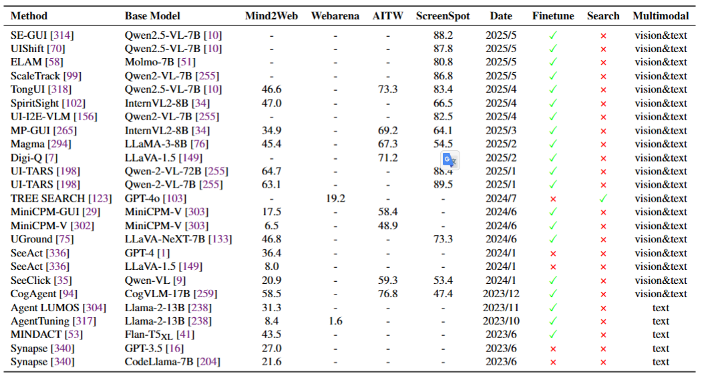

# A Comprehensive Survey on Large Language Model Based Planning

Welcome to the **Awesome-LLM-Planning** repository! This repository is a curated collection of the most influential papers, and benchmarks related to **Large Language Models (LLMs) based Agent Planning**. For a detailed introduction, please refer our survey paper:

**A Comprehensive Survey on Large Language Model Based Planning** 

  

An overview of LLM-based agent planning, covering its definition, methods, evaluation approaches, and analysis and interpretation.

## 1 Planning Methods

### 1.1 External Module Augmented Methods

#### 1.1.1 Planner Enhanced Methods 

* **LLM+P: Empowering Large Language Models with Optimal Planning Proficiency**  
* **Dynamic Planning With A LLM**  
* **PDDLEGO: Iterative Planning In Textual Environments**  
* **PROC2PDDL: Open-Domain Planning Representations From Texts**  
* **Can Llms Plan Paths With Extra Hints From Solvers?**  
* **Robust Planning With Compound LLM Architectures: An LLM-Modulo Approach**  
* **LLM+ Map: Bimanual Robot Task Planning Using Large Language Models And Planning Domain Definition Language**  
* **Explicit Memory Learning With Expectation Maximization**  
* **Think Before You Act: Decision Transformers With Working Memory**  
* **Synapse: Trajectory-As-Exemplar Prompting With Memory For Computer Control**  
* **Generative Agents: Interactive Simulacra Of Human Behavior**  
* **Memorybank: Enhancing Large Language Models With Long-Term Memory**  
* **Ldm2: A Large Decision Model Imitating Human Cognition With Dynamic Memory Enhancement**  
* **Hierarchical Planning For Complex Tasks With Knowledge Graph-Rag And Symbolic Verification**  
* **Z3: An Efficient Smt Solver**  
* **Leveraging Pre-Trained Large Language Models To Construct And Utilize World Models For Model-Based Task Planning**  
* **Learning Adaptive Planning Representations With Natural Language Guidance**  
* **Trip-Pal: Travel Planning With Guarantees By Combining Large Language Models And Automated Planners**  
* **Leveraging Environment Interaction For Automated PDDL Translation And Planning With Large Language Models**  
* **Coupling Large Language Models With Logic Programming For Robust And General Reasoning From Text**  
* **To The Globe (Ttg): Towards Language-Driven Guaranteed Travel Planning**  
* **Position: Llms Can’t Plan, But Can Help Planning In LLM-Modulo Frameworks**  
* **Translating Natural Language To Planning Goals With Large-Language Models** 
* **Planetarium: A Rigorous Benchmark For Translating Text To Structured Planning Languages** 
* **Autoplanbench: Automatically Generating Benchmarks For LLM Planners From PDDL** 
#### 1.1.2 Memory Enhanced Methods 
* **A Survey On Large Language Model Based Autonomous Agents**  
* **The Rise And Potential Of Large Language Model Based Agents: A Survey**  
* **Jarvis-1: Open-World Multi-Task Agents With Memory-Augmented Multimodal Language Models**  
* **Think-In-Memory: Recalling And Post-Thinking Enable Llms With Long-Term Memory**  
* **Memgpt: Towards Llms As Operating Systems**  
* **Large Language Models Are Semi-Parametric Reinforcement Learning Agents**  
* **Mot: Memory-Of-Thought Enables Chatgpt To Self-Improve**  
* **Clin: A Continually Learning Language Agent For Rapid Task Adaptation And Generalization**  
* **Ghost In The Minecraft: Generally Capable Agents For Open-World Environments Via Large Language Models With Text-Based Knowledge And Memory**  
* **Open-Ended Instructable Embodied Agents With Memory-Augmented Large Language Models**  
* **Neural Turing Machines**  
* **End-To-End Memory Networks**  
* **Exploratory Retrieval-Augmented Planning For Continual Embodied Instruction Following**  
* **Crafting Personalized Agents Through Retrieval-Augmented Generation On Editable Memory Graphs**  
* **Learning Memory Mechanisms For Decision Making Through Demonstrations**  
### 1.2 Finetuning-based Methods
#### 1.2.1 Imitation Learning-based Methods 
* **You Only Look At Screens: Multimodal Chain-Of-Action Agents**  
* **Multimodal Web Navigation With Instruction-Finetuned Foundation Models**  
* **Ask-Before-Plan: Proactive Language Agents For Real-World Planning** 
* **Agent-Flan: Designing Data And Methods Of Effective Agent Tuning For Large Language Models**  
* **Training Verifiers To Solve Math Word Problems**  
* **Fireact: Toward Language Agent Fine-Tuning**  
* **Opencodereasoning: Advancing Data Distillation For Competitive Coding**  
* **Distilling Instruction-Following Abilities Of Large Language Models With Task-Aware Curriculum Planning** 
* **Retrieve-Plan-Generation: An Iterative Planning And Answering Framework For Knowledge-Intensive LLM Generation**  
* **Selp: Generating Safe And Efficient Task Plans For Robot Agents With Large Language Models**  
* **Horizon-Length Prediction: Advancing Fill-In-The-Middle Capabilities For Code Generation With Lookahead Planning**  
* **Cooperative Strategic Planning Enhances Reasoning Capabilities In Large Language Models**  
* **Enhancing Reasoning Capabilities Of Llms Via Principled Synthetic Logic Corpus**  
* **Knowagent: Knowledge-Augmented Planning For LLM-Based Agents**  
* **Autoact: Automatic Agent Learning From Scratch Via Self-Planning**  
* **Learning To Plan For Retrieval-Augmented Large Language Models From Knowledge Graphs**  
* **Adapting LLM Agents With Universal Feedback In Communication**  
* **Stream Of Search (Sos): Learning To Search In Language**  
* **Dualformer: Controllable Fast And Slow Thinking By Learning With Randomized Reasoning Traces**  
* **Monte Carlo Tree Search Boosts Reasoning Via Iterative Preference Learning**  
* **Beyond A\*: Better Planning With Transformers Via Search Dynamics Bootstrapping**  
* **Synatra: Turning Indirect Knowledge Into Direct Demonstrations For Digital Agents At Scale** 
* -------------------------------------------
* **Learning To Plan Long-Term For Language Modeling**  
* **Agentgen: Enhancing Planning Abilities For Large Language Model Based Agent Via Environment And Task Generation**  
* **Self-Improvement Towards Pareto Optimality: Mitigating Preference Conflicts In Multi-Objective Alignment**  
* **Mixture-Of-Agents Enhances Large Language Model Capabilities**  
* **Camphor: Collaborative Agents For Multi-Input Planning And High-Order Reasoning On Device**  
* **Agent Planning With World Knowledge Model**  
#### 1.2.2 Feedback-based Methods
* **A Real-World Webagent With Planning, Long Context Understanding, And Program Synthesis**  
* **Closed-Loop Long-Horizon Robotic Planning Via Equilibrium Sequence Modeling**  
* **Autowebglm: A Large Language Model-Based Web Navigating Agent**  
* **Self-Playing Adversarial Language Game Enhances LLM Reasoning**  
* **Mastering Chess And Shogi By Self-Play With A General Reinforcement Learning Algorithm**  
* **Advancing LLM Reasoning Generalists With Preference Trees**  
* **Language Models Can Teach Themselves To Program Better**  
* **React Meets Actre: When Language Agents Enjoy Training Data Autonomy.**  
* **Trial And Error: Exploration-Based Trajectory Optimization For LLM Agents**  
* **Llms In The Imaginarium: Tool Learning Through Simulated Trial And Error**  
* **Can LLM Be A Good Path Planner Based On Prompt Engineering? Mitigating The Hallucination For Path Planning**  
* **Think Smarter Not Harder: Adaptive Reasoning With Inference Aware Optimization**  
* **Boost, Disentangle, And Customize: A Robust System2-To-System1 Pipeline For Code Generation**  
* **Beyond Human Data: Scaling Self-Training For Problem-Solving With Language Models**  
* **Training Language Models To Self-Correct Via Reinforcement Learning**  
* **Flow Of Reasoning: Training Llms For Divergent Problem Solving With Minimal Examples**  
* **Webrl: Training LLM Web Agents Via Self-Evolving Online Curriculum Reinforcement Learning**  
* **Rest-Mcts\*: LLM Self-Training Via Process Reward Guided Tree Search**  
* **Q\*: Improving Multi-Step Reasoning For Llms With Deliberative Planning**  
* **Learning Planning-Based Reasoning By Trajectories Collection And Process Reward Synthesizing**  
* **Gui-R1: A Generalist R1-Style Vision-Language Action Model For Gui Agents**  
* **Ui-R1: Enhancing Action Prediction Of Gui Agents By Reinforcement Learning**  
* **Infigui-R1: Advancing Multimodal Gui Agents From Reactive Actors To Deliberative Reasoners**  
* **Embodied-R: Collaborative Framework For Activating Embodied Spatial Reasoning In Foundation Models Via Reinforcement Learning**  
* **Retool: Reinforcement Learning For Strategic Tool Use In Llms**  
* **Toolrl: Reward Is All Tool Learning Needs**  
* **Otc: Optimal Tool Calls Via Reinforcement Learning**  
* **Alphamaze: Enhancing Large Language Models' Spatial Intelligence Via Grpo**  
* **Swe-Rl: Advancing LLM Reasoning Via Reinforcement Learning On Open Software Evolution**  
* **Self-Play Fine-Tuning Converts Weak Language Models To Strong Language Models**  
* **Learn Beyond The Answer: Training Language Models With Reflection For Mathematical Reasoning**  
* **Self-Play Preference Optimization For Language Model Alignment**  
* **Chain Of Preference Optimization: Improving Chain-Of-Thought Reasoning In Llms**  
* **Cpl: Critical Plan Step Learning Boosts LLM Generalization In Reasoning Tasks**  
* **Enhancing LLM Reasoning Via Critique Models With Test-Time And Training-Time Supervision**  
* **Thinking Llms: General Instruction Following With Thought Generation**  
* **Error Classification Of Large Language Models On Math Word Problems: A Dynamically Adaptive Framework**  
### 1.3 Searching-based Methods
#### 1.3.1 Decomposition-based Methods
* **Rada: Retrieval-Augmented Web Agent Planning With Llms**  
* **Meta-Task Planning For Language Agents**  
* **Agent-Oriented Planning In Multi-Agent Systems**  
* **Deductive Additivity For Planning Of Natural Language Proofs**  
* **Paradise: Evaluating Implicit Planning Skills Of Language Models With Procedural Warnings And Tips Dataset**  
* **Optimizing Chain-Of-Thought Reasoning: Tackling Arranging Bottleneck Via Plan Augmentation**  
* **Least-To-Most Prompting Enables Complex Reasoning In Large Language Models**  
* **Protrix: Building Models For Planning And Reasoning Over Tables With Sentence Context**  
* **Hugginggpt: Solving AI Tasks With Chatgpt And Its Friends In Hugging Face**  
* **Urbanllm: Autonomous Urban Activity Planning And Management With Large Language Models**  
* **Thoughts To Target: Enhance Planning For Target-Driven Conversation**  
* **Plan-Rag: Planning-Guided Retrieval Augmented Generation**  
* **Distilling Script Knowledge From Large Language Models For Constrained Language Planning**  
* **A Human-Like Reasoning Framework For Multi-Phases Planning Task With Large Language Models**  
* **Interpretable Math Word Problem Solution Generation Via Step-By-Step Planning**  
* **Oscar: Operating System Control Via State-Aware Reasoning And Re-Planning**  
* **Msi-Agent: Incorporating Multi-Scale Insight Into Embodied Agents For Superior Planning And Decision-Making**  
* **Verilogcoder: Autonomous Verilog Coding Agents With Graph-Based Planning And Abstract Syntax Tree (Ast)-Based Waveform Tracing Tool**  
* **Can We Further Elicit Reasoning In Llms? Critic-Guided Planning With Retrieval-Augmentation For Solving Challenging Tasks**  
* **Personal Large Language Model Agents: A Case Study On Tailored Travel Planning**  
* **Strength Lies In Differences! Improving Strategy Planning For Non-Collaborative Dialogues Via Diversified User Simulation**  
* **Adapt: As-Needed Decomposition And Planning With Language Models**  
* **Travelagent: An AI Assistant For Personalized Travel Planning**  
#### 1.3.2 Exploration-based Methods
* **Thinking, Fast And Slow**  
* **The Empirical Case For Two Systems Of Reasoning.** 
* **Flow-Of-Options: Diversified And Improved LLM Reasoning By Thinking Through Options**  
* **Tree Of Thoughts: Deliberate Problem Solving With Large Language Models**  
* **Search-In-The-Chain: Interactively Enhancing Large Language Models With Search For Knowledge-Intensive Tasks**  
* **Tree-Planner: Efficient Close-Loop Task Planning With Large Language Models**  
* **Graph Of Thoughts: Solving Elaborate Problems With Large Language Models**  
* **Thought Propagation: An Analogical Approach To Complex Reasoning With Large Language Models**  
* **Avis: Autonomous Visual Information Seeking With Large Language Model Agent**  
* **Toolllm: Facilitating Large Language Models To Master 16000+ Real-World Apis**  
* **Algorithm Of Thoughts: Enhancing Exploration Of Ideas In Large Language Models**  
* **System-1. X: Learning To Balance Fast And Slow Planning With Language Models**  
* **Adaptive Graph Of Thoughts: Test-Time Adaptive Reasoning Unifying Chain, Tree, And Graph Structures**  
* **Step Back To Leap Forward: Self-Backtracking For Boosting Reasoning Of Language Models**  
* **Codetree: Agent-Guided Tree Search For Code Generation With Large Language Models**  
* **Efficient Selectivity And Backup Operators In Monte-Carlo Tree Search**  
* **Bandit Based Monte-Carlo Planning**  
* **Large Language Models As Commonsense Knowledge For Large-Scale Task Planning**  
* **Language Agent Tree Search Unifies Reasoning Acting And Planning In Language Models**  
* **Alphamath Almost Zero: Process Supervision Without Process**  
* **Doubly Robust Monte Carlo Tree Search**  
* **Thoughtsculpt: Reasoning With Intermediate Revision And Search**  
* **Monte Carlo Planning With Large Language Model For Text-Based Games**  
* **Coat: Chain-Of-Associated-Thoughts Framework For Enhancing Large Language Models Reasoning**  
* **Webpilot: A Versatile And Autonomous Multi-Agent System For Web Task Execution With Strategic Exploration**  
* **A Formal Basis For The Heuristic Determination Of Minimum Cost Paths**  
* **Toolchain*: Efficient Action Space Navigation In Large Language Models With A* Search**  
* **Tree Search For Language Model Agents**  
* **LLM-A\*: Large Language Model Enhanced Incremental Heuristic Search On Path Planning**  
* **World Models**  
* **Deep Learning, Reinforcement Learning, And World Models**  
* **Reasoning With Language Model Is Planning With World Model**  
* **Is Your LLM Secretly A World Model Of The Internet? Model-Based Planning For Web Agents**  
* **Reflective Planning: Vision-Language Models For Multi-Stage Long-Horizon Robotic Manipulation**  
* **Worldcoder, A Model-Based LLM Agent: Building World Models By Writing Code And Interacting With The Environment**  
* **Reasonplanner: Enhancing Autonomous Planning In Dynamic Environments With Temporal Knowledge Graphs And Llms**  
* **Solving Math Word Problems With Process-And Outcome-Based Feedback**  
* **Let'S Verify Step By Step**  
* **Qlass: Boosting Language Agent Inference Via Q-Guided Stepwise Search**  
* **Scaling Autonomous Agents Via Automatic Reward Modeling And Planning**  
#### 1.3.3 Decoding-based Methods
* **Speech And Language Processing: An Introduction To Natural Language Processing, Computational Linguistics, And Speech Recognition**  
* **Sequence Transduction With Recurrent Neural Networks**  
* **Self-Evaluation Guided Beam Search For Reasoning**  
* **Chain-Of-Thought Reasoning Without Prompting**  
* **Flap: Flow-Adhering Planning With Constrained Decoding In Llms**  
* **Non-Myopic Generation Of Language Model For Reasoning And Planning**  
* **Chain-Of-Thought Prompting Elicits Reasoning In Large Language Models**  
* **Don't Throw Away Your Value Model! Generating More Preferable Text With Value-Guided Monte-Carlo Tree Search Decoding**  
* **Contrastive Decoding Improves Reasoning In Large Language Models**  
* **Grounded Decoding: Guiding Text Generation With Grounded Models For Embodied Agents**  

## 2 Planning Evaluation
### 2.1 Datasets
#### 2.1.1 Digital Scenarios
##### 2.1.1.1 Web Navigation
* **WebShop: Towards Scalable Real-World Web Interaction with Grounded Language Agents**  
* **Reinforcement Learning on Web Interfaces Using Workflow-Guided Exploration**  
* **Mind2Web: Towards a Generalist Agent for the Web**  
* **WebArena: A Realistic Web Environment for Building Autonomous Agents**  
* **VisualWebArena: Evaluating Multimodal Agents on Realistic Visual Web Tasks**  
* **WebVoyager: Building an End-to-End Web Agent with Large Multimodal Models**  
* **WebLINX: Real-World Website Navigation with Multi-Turn Dialogue**  

##### 2.1.1.2 Mobile Navigation
* **AndroidWorld: A Dynamic Benchmarking Environment for Autonomous Agents**  
* **Mapping Natural Language Instructions to Mobile UI Action Sequences**  
* **META-GUI: Towards Multi-modal Conversational Agents on Mobile GUI**  
* **Android in the Wild: A Large-Scale Dataset for Android Device Control**  
* **On the Effects of Data Scale on UI Control Agents**  
* **Mobile-Env: Building Qualified Evaluation Benchmarks for LLM-GUI Interaction**  
* **A3: Android Agent Arena for Mobile GUI Agents**   

##### 2.1.1.3 Desktop Navigation
* **OSWorld: Benchmarking Multimodal Agents for Open-Ended Tasks in Real Computer Environments**  
* **AgentStudio: A Toolkit for Building General Virtual Agents**  
* **TheAgentCompany: Benchmarking LLM Agents on Consequential Real World Tasks**  
* **Windows Agent Arena: Evaluating Multi-Modal OS Agents at Scale**  
* **WorkArena: How Capable Are Web Agents at Solving Common Knowledge Work Tasks?**  

#### 2.1.2 Embodied Scenarios
##### 2.1.2.1 Household Robot
* **ALFWorld: Aligning Text and Embodied Environments for Interactive Learning**  
* **ALFRED: A Benchmark for Interpreting Grounded Instructions for Everyday Tasks**  
* **VirtualHome: Simulating Household Activities via Programs**  
* **ScienceWorld: Is your Agent Smarter than a 5th Grader?**  
* **Watch-And-Help: A Challenge for Social Perception and Human-AI Collaboration**  
* **LangSuitE: Planning, Controlling and Interacting with Large Language Models in Embodied Text Environments**  
* **ActPlan-1K: Benchmarking the Procedural Planning Ability of Visual Language Models in Household Activities**  
* **PARTNR: A Benchmark for Planning and Reasoning in Embodied Multi-agent Tasks**  
* **Embodied Agent Interface: Benchmarking LLMs for Embodied Decision Making**  
* **LoTa-Bench: Benchmarking Language-oriented Task Planners for Embodied Agents**  
* **GOAT-Bench: A Benchmark for Multi-Modal Lifelong Navigation**  
* **BEHAVIOR-1K: A Human-Centered, Embodied AI Benchmark with 1,000 Everyday Activities and Realistic Simulation**  

##### 2.1.2.2 Manipulation Robot
* **VLMbench: A Compositional Benchmark for Vision-and-Language Manipulation**  
* **VLABench: A Large-Scale Benchmark for Language-Conditioned Robotics Manipulation with Long-Horizon Reasoning Tasks**  
* **VIMA: General Robot Manipulation with Multimodal Prompts**  
* **EmbodiedBench: Comprehensive Benchmarking Multi-modal Large Language Models for Vision-Driven Embodied Agents**  
* **RoCo: Dialectic Multi-Robot Collaboration with Large Language Models**  

##### 2.1.2.3 Minecraft Robot
* **MineDojo: Building Open-Ended Embodied Agents with Internet-Scale Knowledge**  
* **Craftax: A Lightning-Fast Benchmark for Open-Ended Reinforcement Learning**  
* **MinePlanner: A Benchmark for Long-Horizon Planning in Large Minecraft Worlds**  
* **TeamCraft: A Benchmark for Multi-Modal Multi-Agent Systems in Minecraft**  
* **Plancraft: an evaluation dataset for planning with LLM agents**  
* **MindAgent: Emergent Gaming Interaction**  
* **On the Utility of Learning about Humans for Human-AI Coordination**  

##### 2.1.2.4 Autonomous Driving
* **PCA-Bench: Evaluating Multimodal Large Language Models in Perception-Cognition-Action Chain**  
* **AlphaDrive: Unleashing the Power of VLMs in Autonomous Driving via Reinforcement Learning and Reasoning**  

#### 2.1.3 Everyday Scenarios
##### 2.1.3.1 Travel Planning
* **TravelPlanner: A Benchmark for Real-World Planning with Language Agents**  
* **ChinaTravel: A Real-World Benchmark for Language Agents in Chinese Travel Planning**  
* **NATURAL PLAN: Benchmarking LLMs on Natural Language Planning**  

##### 2.1.3.2 Workflow
* **FlowBench: Revisiting and Benchmarking Workflow-Guided Planning for LLM-based Agents**  
* **Open Grounded Planning: Challenges and Benchmark Construction**  
* **HuggingGPT: Solving AI Tasks with ChatGPT and its Friends in Hugging Face**  
* **TaskBench: Benchmarking Large Language Models for Task Automation**  
* **TaskLAMA: Probing the Complex Task Understanding of Language Models**  
* **Benchmarking Agentic Workflow Generation**  
* **Multimodal Procedural Planning via Dual Text-Image Prompting**  
* **Interleaved Scene Graphs for Interleaved Text-and-Image Generation Assessment**  

##### 2.1.3.3 Tool Calling
* **ToolLLM: Facilitating Large Language Models to Master 16000+ Real-world APIs**  
* **AppWorld: A Controllable World of Apps and People for Benchmarking Interactive Coding Agents**  
* **API-Bank: A Comprehensive Benchmark for Tool-Augmented LLMs**  
* **ToolComp: A Multi-Tool Reasoning & Process Supervision Benchmark** 
* **ToolSandbox: A Stateful, Conversational, Interactive Evaluation Benchmark for LLM Tool Use Capabilities**  
* **ToolTalk: Evaluating Tool-Usage in a Conversational Setting**  

##### 2.1.3.4 Code Generation
* **SWE-bench: Can Language Models Resolve Real-World GitHub Issues?**  
* **Training Software Engineering Agents and Verifiers with SWE-Gym**  
* **Evaluating Large Language Models Trained on Code**  

##### 2.1.3.5 Game Playing
* **VSP: Assessing the dual challenges of perception and reasoning in spatial planning tasks for VLMs**  
* **TextWorld: A Learning Environment for Text-based Games**  
* **BabyAI: A Platform to Study the Sample Efficiency of Grounded Language Learning**  
* **PlanBench: An Extensible Benchmark for Evaluating Large Language Models on Planning and Reasoning about Change**  

#### 2.1.4 Vertical Scenarios
##### 2.1.4.1 Machine Learning
* **MLE-bench: Evaluating Machine Learning Agents on Machine Learning Engineering**  

##### 2.1.4.2 AI Research
* **ResearchArena: Benchmarking Large Language Models' Ability to Collect and Organize Information as Research Agents** 
* **CycleResearcher: Improving Automated Research via Automated Review**  

##### 2.1.4.3 Biological Research
* **BioPlanner: Automatic Evaluation of LLMs on Protocol Planning in Biology**  

##### 2.1.4.4 Financial Simulation
* **Put Your Money Where Your Mouth Is: Evaluating Strategic Planning and Execution of LLM Agents in an Auction Arena**  

##### 2.1.4.5 Interior Design
* **DStruct2Design: Data and Benchmarks for Data Structure Driven Generative Floor Plan Design**  
* **Tell2Design: A Dataset for Language-Guided Floor Plan Generation**  

##### 2.1.4.6 Comprehensive
* **AgentBench: Evaluating LLMs as Agents**  

* **VisualAgentBench: Towards Large Multimodal Models as Visual Foundation Agents**  

### 2.2 Evaluation Metrics

  

The corresponding relationship between planning evaluation metrics and some typical planning datasets. The left three columns represent evaluation metrics of different granularities, while the rightmost column denotes the dataset.

### 2.3 Performance Comparisons
#### 2.3.1 Web Navigation Performance
* **TongUI: Building Generalized GUI Agents by Learning from Multimodal Web Tutorials**  
* **SpiritSight Agent: Advanced GUI Agent with One Look**  
* **UI-E2I-Synth: Advancing GUI Grounding with Large-Scale Instruction Synthesis** 
* **MP-GUI: Modality Perception with MLLMs for GUI Understanding**  
* **Magma: A Foundation Model for Multimodal AI Agents**  
* **Digi-Q: Learning Q-Value Functions for Training Device-Control Agents**  
* **UI-TARS: Pioneering Automated GUI Interaction with Native Agents**  
* **Tree Search for Language Model Agents**  
* **GUICourse: From General Vision Language Models to Versatile GUI Agents**  
* **MiniCPM-V: A GPT-4V Level MLLM on Your Phone**  
* **Navigating the Digital World as Humans Do: Universal Visual Grounding for GUI Agents**  
* **GPT-4V(ision) is a Generalist Web Agent, if Grounded**  
* **SeeClick: Harnessing GUI Grounding for Advanced Visual GUI Agents**  
* **CogAgent: A Visual Language Model for GUI Agents**  
* **Agent Lumos: Unified and Modular Training for Open-Source Language Agents**  
* **AgentTuning: Enabling Generalized Agent Abilities for LLMs**  
* **Mind2Web: Towards a Generalist Agent for the Web**  
* **Synapse: Trajectory-as-Exemplar Prompting with Memory for Computer Control**  

  

The performance comparison of different models and methods in web navigation.The value of Mind2Web is the average step success rate of the three subsets.The value of Webarena is task successrate.The value of AITW is step success rate of the subsets.The value of ScreenSpot is step success rate.

#### 2.3.2 Embodied Scenarios Performance
* **ATLaS: Agent Tuning via Learning Critical Steps** 
* **DebFlow: Automating Agent Creation via Agent Debate** 
* **Agent-R: Training Language Model Agents to Reflect via Iterative Self-Training**  
* **AgentRefine: Enhancing Agent Generalization through Refinement Tuning**  
* **AgentGym: Evolving Large Language Model-based Agents across Diverse Environments**  
* **Agent Planning with World Knowledge Model**  
* **Trial and Error: Exploration-Based Trajectory Optimization for LLM Agents**  
* **KnowAgent: Knowledge-Augmented Planning for LLM-Based Agents**  
* **AgentTuning: Enabling Generalized Agent Abilities for LLMs**  

  

The performance comparison of different models and methods in embodied.This refers to the average of seen and unseen in the original paper, or the value reported in the original paper.

## 3 Analysis And Interpretation
### 3.1 External Interpretation
* **The pitfalls of next-token prediction**  
* **Revealing the Barriers of Language Agents in Planning**  
* **To CoT or not to CoT? Chain-of-thought helps mainly on math and symbolic reasoning**  
* **Chain of Thoughtlessness? An Analysis of CoT in Planning**  
* **Confidence Matters: Revisiting Intrinsic Self-Correction Capabilities of Large Language Models**  
* **Self-Refine: Iterative Refinement with Self-Feedback**  
* **Small Language Models Need Strong Verifiers to Self-Correct Reasoning**  
* **A Theoretical Understanding of Self-Correction through In-context Alignment**  

### 3.2 Internal Interpretation
* **Do Large Language Models Latently Perform Multi-Hop Reasoning?**  
* **Do language models plan ahead for future tokens?**  
* **Unlocking the Future: Exploring Look-Ahead Planning Mechanistic Interpretability in Large Language Models** 
* **ALPINE: Unveiling the Planning Capability of Autoregressive Learning in Language Models** 
* **Iteration Head: A Mechanistic Study of Chain-of-Thought** 

  

The illustration of external interpretation and internal interpretation, respectively.